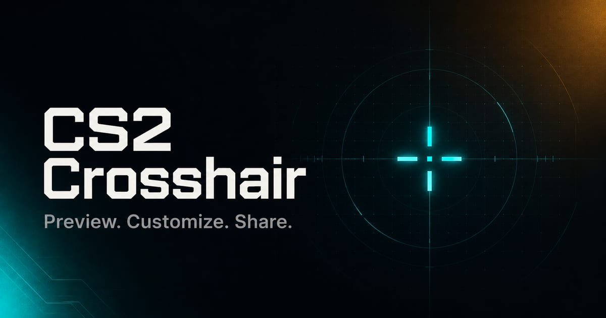

# CS2 Crosshair Studio

[CS2 Crosshair Studio](https://delli.cc/) is a private, browser-based workspace for creating, editing, previewing, saving, and sharing Counter-Strike 2 crosshairs.



Everything runs locally in your browser. Crosshair codes, settings, aliases, drafts, history, favorites, and feedback choices are not sent to a server.

## How it works

1. Paste a CS2 `CSGO-...` share code or start from a preset.
2. Tune the crosshair while watching the preview update immediately.
3. Copy a command, code, or share link, or download a ready-to-use `.cfg` file.

[Open the studio](https://delli.cc/) · [Report an issue](https://github.com/Softhe/cs2-crosshair/issues/new/choose)

## Features

### Create and customize

- Import and validate CS2 crosshair share codes, including one-click clipboard paste.
- Start from Small static, Dot, High visibility, or Classic green presets.
- Adjust style, length, gap, thickness, color, opacity, outline and outline thickness, center dot, and T style.
- Choose a preset color or use the custom color picker.
- Reset the workspace to a known default at any time.
- Follow a dismissible first-run guide that stays dismissed on the current device.

### Preview and personalize

- See changes immediately in a browser-rendered crosshair preview.
- Switch between Tactical, CS2, and Crimson palettes; the selection persists locally.
- Use layouts tailored for mobile, desktop, and ultrawide screens.
- Keep copy and download actions within reach through mobile quick actions.

### Export and share

- Copy the generated CS2 console command with a button or `Ctrl+Enter` / `Cmd+Enter`.
- Copy the current share code or a canonical `delli.cc` share link.
- Download a ready-to-use `.cfg` file with a safe generated filename.
- Add an optional alias and copy the matching autoexec command for quick switching.
- Inspect the generated CS2 console variables before exporting.

### Save locally

- Restore the latest draft after a refresh.
- Keep up to 20 recently imported or exported crosshairs and up to 50 favorites.
- Search the local library by name or share-code fragment.
- Rename, reload, copy, favorite, and remove saved entries.
- Export the local library as JSON and restore it from a backup.

### Privacy-conscious feedback

- Record an optional ease rating only in the current browser.
- Review coarse diagnostics and an optional note before explicitly opening a prefilled GitHub issue.
- Never include crosshair codes, settings, aliases, URLs, or local history in the generated issue.

## Preview accuracy

The live preview is a close browser approximation. Resolution, aspect ratio, display scaling, and CS2 rendering can produce small visual differences. Generated share codes, console commands, and config files use the actual crosshair settings rather than measurements from the preview.

## Supported links

| URL | Behavior |
| --- | --- |
| `/` | Opens the studio and restores the local draft or default crosshair. |
| `/?code=CSGO-...` | Canonical share link. |
| `/?crosshair=CSGO-...` | Supported compatibility query. |
| `/custom` | Redirects to `/` while preserving the query string and hash. |
| `/CSGO-...` | Opens a valid legacy path-based share link. |
| Any other path | Shows the not-found page. |

Use query-based links for anything new. The legacy path format remains available for existing shared URLs.

## Development

Requirements: Node.js 20 or newer and pnpm 11.9.0.

```sh
corepack enable
pnpm install
pnpm dev
```

Essential commands:

| Command | Purpose |
| --- | --- |
| `pnpm dev` | Start the local Vite development server. |
| `pnpm check` | Run linting, type checks, utility checks, unit/component tests, and a verified production build. |
| `pnpm test:e2e` | Build the site and run Playwright smoke tests at desktop and mobile widths. |
| `pnpm test:watch` | Run the Vitest suite in watch mode. |
| `pnpm verify:release-readiness` | Verify CS2 reference and 2.1 playtest evidence. |
| `pnpm smoke:production` | Probe the deployed `https://delli.cc` routes and metadata. |

The application uses React, TypeScript, Vite, Tailwind CSS, Vitest, and Playwright.

## Project documentation

- [Architecture](docs/ARCHITECTURE.md)
- [Testing](docs/TESTING.md)
- [Release and deployment](docs/RELEASE.md)
- [Preview calibration](docs/PREVIEW_CALIBRATION.md)
- [CS2 screenshot guide](docs/CS2_SCREENSHOT_GUIDE.md)
- [2.1 playtest](docs/PLAYTEST_2_1.md)
- [Changelog](CHANGELOG.md)

## Deployment

Pull requests and pushes to `main` run the release gate and browser smoke suite. Pushes to `main` deploy the verified build to GitHub Pages, retain the `delli.cc` custom domain, and probe the production routes after deployment. See the [release guide](docs/RELEASE.md) for the maintained checklist and compatibility contract.

## License

Built by [delli.cc](https://delli.cc/). No separate open-source license is declared in this repository.
