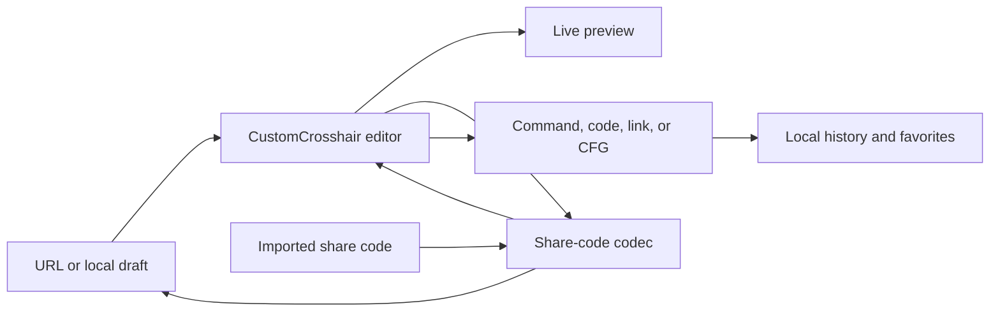

# Architecture

## Overview

CS2 Crosshair Studio is a static single-page application. It has no application backend: share-code conversion, editing, persistence, config generation, and downloads run in the browser.

## Application composition

- `src/main.tsx` mounts React and the application error boundary.
- `src/App.tsx` owns routing, shared tooltip and toast providers, and the lazy not-found page.
- `src/pages/Index.tsx` composes the studio and lazy-loaded FAQ.
- `src/pages/CustomCrosshair.tsx` owns the current editable crosshair, URL synchronization, actions, and responsive studio layout.
- `src/components/studio/` contains focused import, customization, preview, autoexec, and mobile-action surfaces.
- `src/components/CustomCrosshairPreview.tsx` and `CrosshairShape.tsx` render the approximation shown in the editor.
- `src/components/CrosshairHistory.tsx` presents recent exports and favorites from local storage.

The older `CS2ConfigGenerator` and its separate preview were removed. New work should target the unified studio and its supporting modules.

## Core modules

| Module | Responsibility |
| --- | --- |
| `src/lib/cs2-sharecode.ts` | Encode and decode Valve-style share-code bytes and convert crosshair values to console variables. |
| `src/lib/crosshair-preview.ts` | Clamp editable values and calculate browser-preview geometry. |
| `src/lib/crosshair-output.ts` | Validate input and generate console commands and `.cfg` content. |
| `src/lib/crosshair-config.ts` | Sanitize aliases and create safe config filenames. |
| `src/lib/share-url.ts` | Read canonical and compatibility URLs and generate canonical query links. |
| `src/lib/custom-crosshair-storage.ts` | Persist the current draft as an encoded share code. |
| `src/lib/storage.ts` | Manage history, favorites, user settings, and versioned data migration. |
| `src/lib/clipboard.ts` | Copy text with browser-compatible fallbacks. |
| `src/lib/observability.ts` | Record coarse, session-only product counters and web-vital snapshots without remote transmission. |

Keep conversion and formatting rules in these pure modules where possible. Components should coordinate user interaction rather than duplicate the codec or output rules.

## State and persistence

The encoded share code is the portable representation of editor state. Editing a control clamps the value, re-encodes the crosshair, and replaces the current URL with `/?code=...`. Loading a valid URL or history entry decodes it back into editor state.

Browser storage is optional and failure-tolerant:

- `cs2_custom_crosshair_draft` stores the latest editor draft.
- `cs2_crosshair_history` stores up to 20 recent copied commands or downloaded configs, deduplicated by share code.
- `cs2_crosshair_favorites` stores up to 50 favorites.
- `cs2_crosshair_settings` is reserved for local user settings and participates in storage import/export.

Clearing site data removes this information. There is no account or device synchronization.

Aggregate interaction counters and LCP/CLS snapshots live only in `sessionStorage` for the current tab. They contain a coarse viewport bucket but never share codes, aliases, URLs, clipboard contents, or other user-entered values, and the application does not transmit them to a server.

## Routes and static hosting

`src/App.tsx` recognizes the root studio, the `/custom` redirect, valid legacy share-code paths, and the not-found page. The `/custom` redirect preserves its query string and hash. `src/lib/share-url.ts` prefers the `code` query parameter, accepts the older `crosshair` query parameter, and can read a legacy path code.

`scripts/prepare-static-pages.mjs` runs after the Vite build and prepares GitHub Pages compatibility documents:

- `dist/404.html` boots the SPA for a legacy path request.
- `dist/custom/index.html` and `dist/custom.html` allow old `/custom` entry points to reach the redirect.

New links must use `/?code=...`. A valid legacy `/CSGO-...` path remains usable, but its first GitHub Pages response can carry a 404 status. Invalid paths must render the not-found page rather than being interpreted as share codes.

`scripts/verify-build.mjs` validates the required documents, custom domain, optimized `og-image.jpg`, metadata, and app fallbacks in `dist/`. `scripts/smoke-site.mjs` probes the deployed root, canonical query, `/custom/`, legacy-code, and invalid-path responses after deployment.

## Privacy and security boundaries

- The app does not need a server to process a crosshair.
- Clipboard access depends on browser permission and generally requires HTTPS or localhost.
- Imported text, alias names, and decoded numeric values must remain validated or sanitized before being used in output or filenames.
- The preview is an approximation, while encoded values and generated console variables are the authoritative output.
